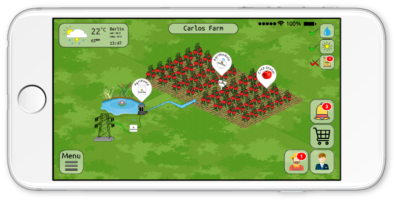

# Agrimodule - Website & Web App
> demo website and demo agrimodule webapp for IoT digital farming.



## Installation:

##### With :


1. Clone repository and go inside the repository folder "site-app-docker"
```sh
git clone https://github.com/Fantaso/site-app-docker
```

2. Build the docker images
```sh
docker-compose build
```

3. Initialize database used in the web app
```sh
docker-compose run --rm app python manage.py db init
```

4. Create the database mapping to migrate the database
```sh
docker-compose run --rm app python manage.py db migrate
```

5. Apply the migration changes detected to the database
```sh
docker-compose run --rm app python manage.py db upgrade
```

6. Add a test user to login into web app
```sh
docker-compose run --rm app python manage.py addusers
```

7. Add the crops data to the database
```sh
docker-compose run --rm app python manage.py addcrops
```

8. Add the licenses data to the database (licenses are string identifiers that allows to control which IoT sensors belongs to which user, and it is used for the IoT sensors to send the sensor data to the web app)
```sh
docker-compose run --rm app python manage.py addlicenses
```

9. Run the Docker containers
```sh
docker-compose up
```


## Usage:
Once docker-compose is done downloading all images and none of the services failed after you have run the containers with `docker-compose up`


#### 1. Access Website
The web application should be running and you can access it in your web browser at _http://0.0.0.0:5000_, which will take you to the website and there in the navigation bar you can find the **login** link.


#### 2. Access App - Flask
Access the web app at _http://0.0.0.0:5000/app_
You will be prompt to enter **Username** and **Password**, which we have registered in `Step # 6` of the installation. Or you could register a new user following the link at the login page.

Login information:
- Username = fan@fantaso.de
- Password = **123456**


#### 3. Access Database Client - Adminer
Access the web app at _http://0.0.0.0:8080_
You will be prompt to enter **System**, **Server**, **Username**, **Password**, **Database** which has been pre-configured within the web app at `config.py` and the `docker-compose.yml` files.

Login information:
- System = **PostgreSQL**
- Server = **db**
- Username = **postgres**
- Password = **password**
- Database = **mydb**


## Information:
| Technology Stack | |
| - |:-:|
| Python          |  |  
| Flask           |  |  
| SQLAlchemy      |  |
| PostgreSQL      |  |
| Docker          |  |
| Docker-Compose  |  |
| Adminer         |  |

[https://github.com/Fantaso/site-app-docker](https://github.com/fantaso/)
